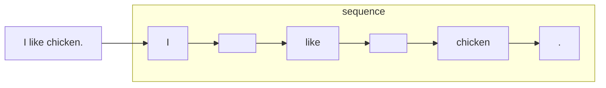
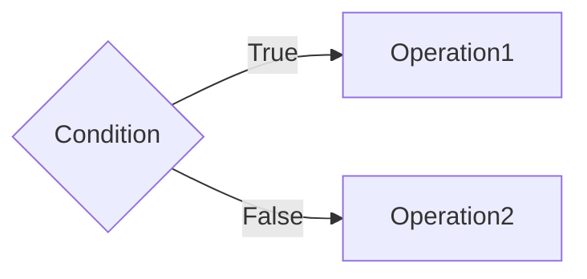
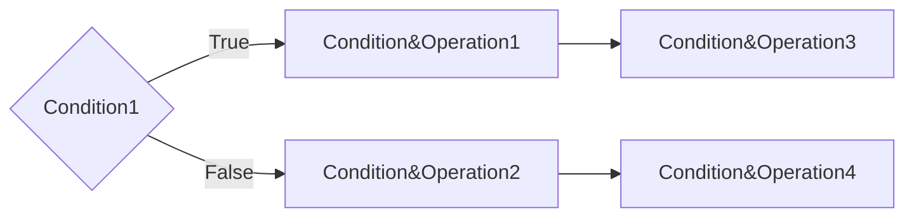

# sentence-spliter

[toc]

## 简介

sentence-spliter 句子切分工具：将一个长句或者段落，切分为若干短句的 List 。支持自然切分，中间切分等。

目前支持语言：中文， 英文，韩语


## Architechture

- 项目结构

```
.
├── doc								# 补充文档
├── LICENSE							# 许可证
├── MANIFEST.in						# 用于setup时包含其他文件
├── pyproject.toml					# 用于构建项目
├── README.md
├── requirements.txt
├── sentence_spliter
│   ├── architect					# 存放切句的基本单元
│   ├── cutter4grammar				# 语法纠错定制的切句
│   ├── en_cutter					# 英文切句
│   ├── test						# 单元测试
│   ├── utility						# 其他工具函数
│   └── zh_cutter					# 中文切句
└── setup.py						# setup.py
```

更详细的目录结构见 [链接](doc/detail.md)


## Setup

git 安装

```
git clone git@git.duowan.com:ai/nlp/sentence-spliter.git
pip install -U pip
pip install -r requirements.txt
```


PYPI 安装

```
pip install sentence_spliter
```


## API

### 请求示例

```
curl --location --request POST 'https://rosetta-nlp-api.duowan.com/api/v1/sentence-spliter/en-sentence-spliter' \
--header 'Content-Type: application/json' \
--data-raw '{
  "paragraphs":["A long time ago..... there is a mountain, and there is a temple in the mountain!!! And here is an old monk in the temple!?...."] ,
  "options": {
      "max_len": 30,
      "min_len": 6
  }
} '
```


- Request

```
{
  "paragraphs":["A long time ago..... there is a mountain, and there is a temple in the mountain!!! And here is an old monk in the temple!?...."] ,
  "options": {
      "max_len": 30,
      "min_len": 6
  }
} 
```


- Response

```
{
    "code": 0,
    "data": {
        "paragraphs": [
            "A long time ago..... there is a mountain, and there is a temple in the mountain!!! And here is an old monk in the temple!?...."
        ],
        "sub_sentences": [
            [
                [
                    "A long time ago..... there is a mountain, and there is a temple in the mountain!!!"
                ],
                [
                    " And here is an old monk in the temple!?...."
                ]
            ]
        ],
        "version": "1.0.0"
    },
    "message": "success"
}
```


  ### 响应参数说明

| **字段名**    | **类型** | **说明**           |
| :------------ | :------- | :----------------- |
| paragraphs    | String   | 需要切分的段落列表 |
| sub_sentences | String   | 切分完成的子句     |

接口相关更多内容见[接口文档](./doc/interface.md)

**<font color="#dd0000">特别注意：version字段改动涉及广东部门是否需要重跑流水线  </font>**[链接](./doc/detail#version-number)  


## 状态机

### Data

需要用到的主要辅助数据为以下两个：

- 白名单表： <cutter>/white_list.txt
- 权重表：<cutter>/weights_list.txt


### Format

白名单表格式：

```
Dr.
U!S!A!
No.
abbr.
Brig.
Ltd.
b.
N.
hr.
```

每行一个字符串，算法扫描到白名单中被记录字符串中的结束符号将会不计为一种象征结束的标志。


权重表:

```
and 10
or 10
but 10
even 10
however 10
whenever 10
whatever 10
although 10
thought 10
```

每行为：`word`+`weight`的格式，表示各个有转折、承接上下文等作用含义的词在需要句内切割时的权重大小。


### 介绍

以下句子作为样本：

```python
sentence = 'I like chicken. I like chicken.'
```


#### ***Sequence***

Sequence模块首先将需要切割的句子转换为某种特殊的序列格式。


sequence将直接进入状态机


#### ***Condition*** and ***Operation***

Condition模块表示执行某个动作之前的某个条件或者判断，若满足该条件则执行，否则执行不满足该条件的动作。

Operation模块表示某个动作或者称为操作




#### ***Condition&Operation***模块

由一系列上图Condition&Operation组成的模块

表示一连串的判断、动作序列组合叠加

进而




#### ***Logic***

上述Condition&Operation模块形成了整个Logic

所有的Condition&Operation模块进一步叠加得到整个大的逻辑图


### 运行

- 导入相关包

```python
from sentence_spliter.en_cutter.en_sequence import Sequence 				# 导入英文切句框架内的sequence类
from sentence_spliter.en_cutter.logic import SimpleLogic, LongShortLogic	# 导入英文切句框架内的logic类
```

- 加载句子为sequence类

```python
sentence = 'I like chicken. I like chicken.'								# 例句
seq = Sequence(sentence)                                                    # 转化为sequence
simple_logic = SimpleLogic()												# 自然切句逻辑
long_logic = LongShortLogic(max_len=max_len, min_len=min_len)				# 切割长短句
```

- 执行切句

```
simple_result = simple_logic.run(seq, debug=True)
long_results = long_logic.run(seq, debug=True)
```


## 打包上传

- 打开setup.py，修改相应的配置（version等）

```python
from setuptools import setup, find_packages

setup(
    name="sentence-spliter",
    version="X.X.X",
    author="<your name>",
    author_email="<your email>",
	...
)
```

- 在项目根目录运行以下命令

```
./bin/package.sh
```

- 键入账号和密码

```
Enter your username: <your username>
Enter your password: <your password>
```

- 等待上传即可

详细教程可见[链接](https://packaging.python.org/en/latest/tutorials/packaging-projects/)
